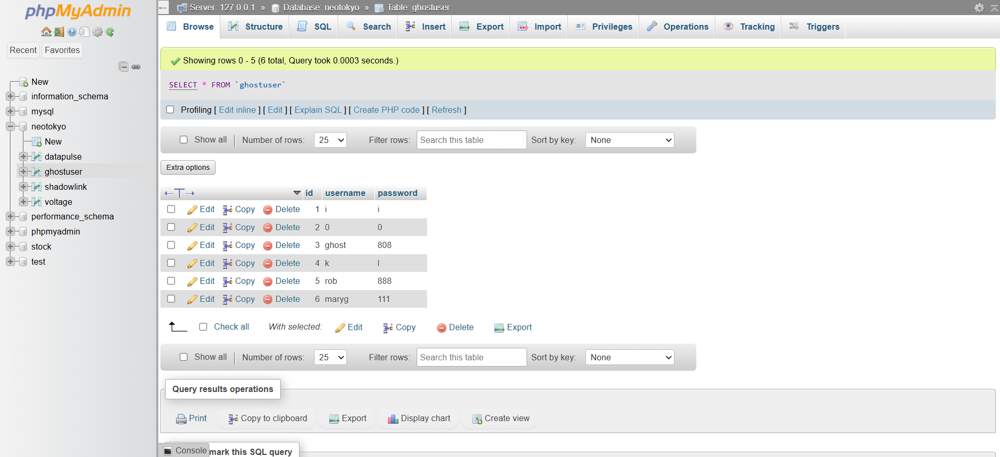
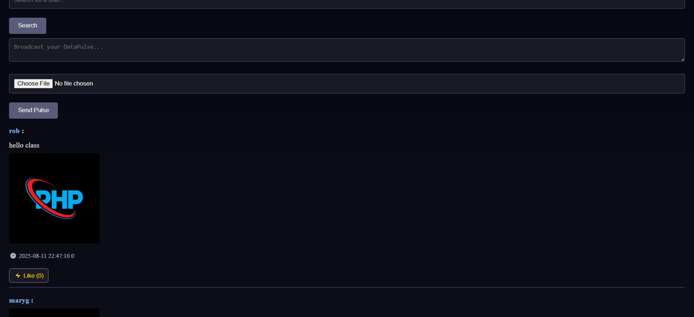
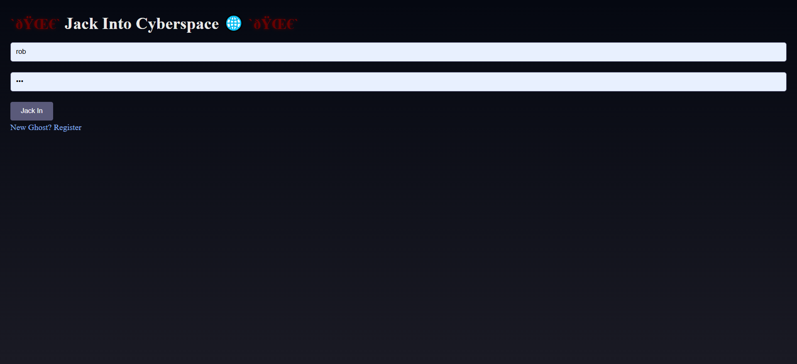
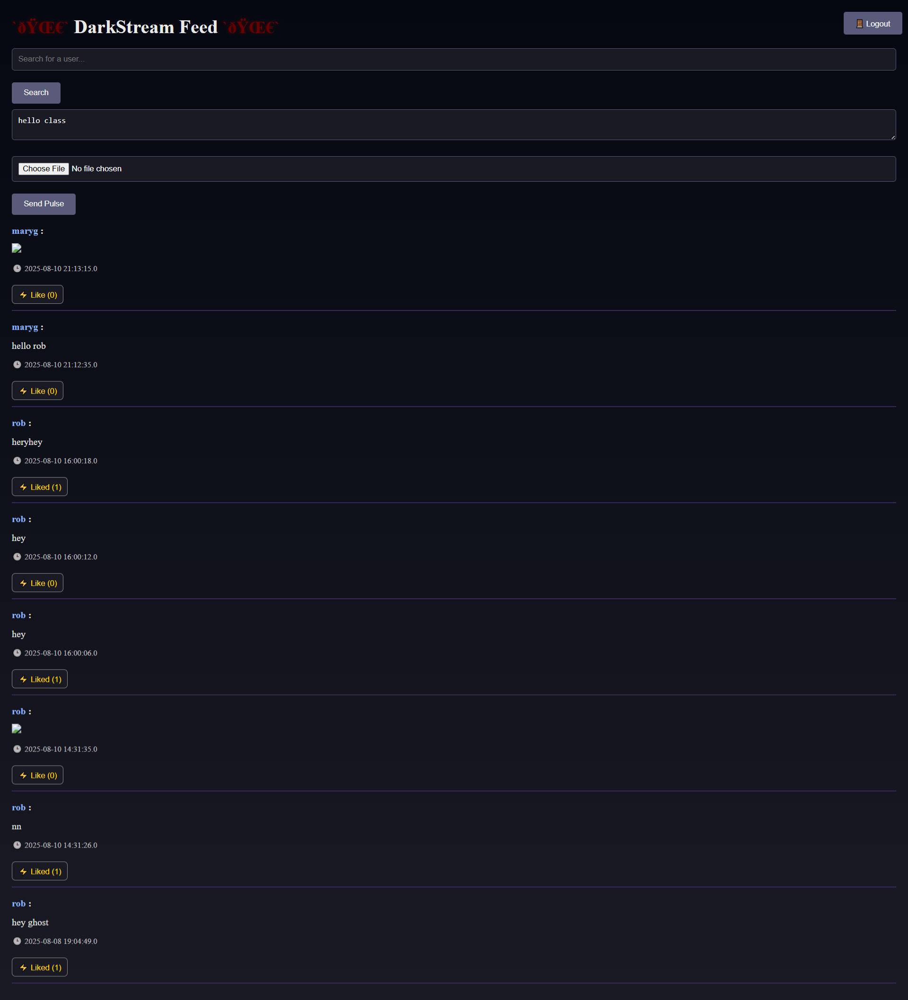

<<<<<<< HEAD
# NeoTokyo Social Platform

A simple Java-based social media web application built with JSP/Servlets, MySQL, and Tomcat.  
Features user accounts, posts, likes, and following functionality — styled with a NeoTokyo cyberpunk theme.

---

## Table of Contents
1. [Description](#description)
2. [Demo Screenshot](#demo-screenshot)
3. [Prerequisites](#prerequisites)
4. [Usage](#usage)
5. [Future Features](#future-features)
6.[Installation](#Installation)

---

## Description

This project allows users to:
- Create an account and log in.
- Post text updates and images.
- Like (Voltage) posts from other users.
- Follow (ShadowLink) other accounts.
- View posts from accounts they follow in chronological order.

Built for academic purposes to demonstrate:
- MVC architecture (Models, Views, Controllers)
- JSP-based front-end rendering
- Secure SQL operations

**Notes:**  
I wanted to try to make a site similar to the old message boards of the early 2000s where they were awkward to navigate.  
Some bugs in the site still need improvement, like the page jumping when you like a post.  
Overall, the weird design — like the broken Unicode — was done on purpose.

---

## Demo Screenshot

  
  
  
  

---

## Usage
1. Register a new account.
2. Log in.
3. Create and view posts.
4. Like (Voltage) other posts.
5. Follow (ShadowLink) other users.

---

## Future Features (if I continue this after class)
- Hashtags & trending topics
- Private messaging
- User profile customization
- Comment threads

## Installation
I used the Apache Netbeans to compile and run the program. XAMPP was used to set
up the database.

## Terminology (NeoTokyo Glossary)

- **GhostUser** → A registered user account (like “users” table).  
  *Influence:* Inspired by *Ghost in the Shell*, where people’s digital identity is called a “ghost.” It gives user accounts a cyberpunk identity rather than plain usernames.  

- **DataPulse** → A tweet/post (the “pulses” of data in the network).  
  *Influence:* Draws on cyberpunk slang where information flows in “pulses” or “streams.” Each post is imagined as a heartbeat of the digital city.  

- **Voltage** → A like on a post (measures the energy/attention of a pulse).  
  *Influence:* Comes from hacking/electric metaphors — instead of hearts or thumbs, posts gain literal jolts of energy when noticed.  

- **ShadowLink** → A follow relationship (one user linking into another’s feed).  
  *Influence:* Evokes underground networks and hidden paths, giving the idea that following someone is like tapping into their shadowed datastream.  

- **Darkstream** → The homepage/feed showing posts from yourself and those you follow.  
  *Influence:* Based on the “data stream” metaphor for the internet, twisted into something ominous and underground, like a darknet feed.  

- **HoloFeed** → A profile page showing all posts from a single user.  
  *Influence:* Inspired by holograms and sci-fi HUDs — a user’s profile becomes their projected holographic feed.  
=======
# Cyberspace

>>>>>>> 84c51de595e6a3b1d40c0a33e7d701dc7bb1c9bb

## How to Test
1) Seed DB: `mysql < docs/TEST_DATA.sql`
2) Manual checks: `docs/REGRESSION_CHECKLIST.md`
3) Unit tests: see `tests/unit/DBConnectionTest.java`
4) E2E (optional): `python tests/e2e/login_flow_example.py`
